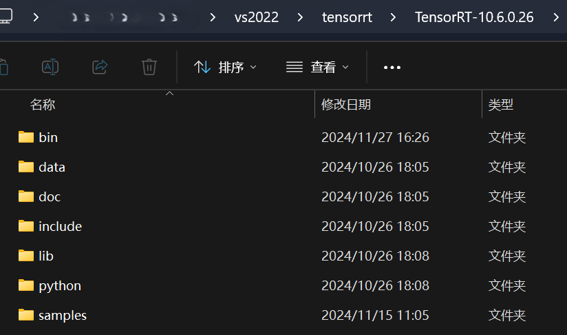

# TensorRT Plugin Example - FPS Sampling

这是一个使用TensorRT自定义插件的示例项目，实现了最远点采样(Furthest Point Sampling, FPS)算法。该算法常用于点云处理中的点云下采样。

## 环境要求

- CUDA 11.0+
- TensorRT 10.0+
- CMake 3.20+
- Visual Studio 2019+ (Windows)

## 构建步骤

1. 修改CMakeLists.txt中的TensorRT路径:
`
set(TRT_ROOT_DIR "path/to/your/tensorrt")
`

2. 使用cmake正常编译，我这里使用的是vs2022的编译工具

## 使用说明

有一个简单的示例:

1. 创建TensorRT自定义插件
2. 在TensorRT网络中使用该插件
3. 执行点云下采样

主要功能:

- 输入: 形状为[batch_size, num_points, 3]的点云数据
- 输出: 形状为[batch_size, num_samples]的采样点索引
- 采样方法: 最远点采样(FPS)算法

## 注意事项

1. 确保CUDA和TensorRT的版本兼容
2. 检查GPU计算能力是否满足要求
3. Windows用户需要确保所有TensorRT DLL文件在可执行文件目录下
4. 如果是使用visual studio 的编译工具，要确定 vs2019要求cuda的版本是11.x，vs2022 要求cuda版本12.x

### 友好声明

- 关于fps采样的cuda实现代码并不是我写的，是其他github项目的，忘记在哪copy过来的了
- 这只是一个简单的学习代码

## License

MIT License
